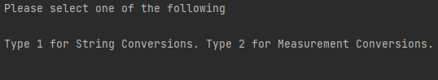

<h1>String and Unit Measurement Converter in Python</h1>

### Introduction
 
This repo exists to help understand basic programming in Python and consists of code that was written for an assessment.
For this assessment it was required to design and produce software that met certain functionality requirements (addressed in the 'Module Descriptions' section) using basic concepts of Software Engineering.

The program allows the user to multiple String and Measurement conversions.

String Conversions Implemented:
>a. Converting a given string to upper case or lower case. 
b. Identify whether numeric values are in a given string. 
c. Identify whether a given string is a valid number or not. 
d. Remove any numeric values in a given string and then convert the string to upper
case or lower Case.

Length Measurement Unit Conversions:
>a. Converting a number which represents a length given in meters to feet and vice
versa and centimeter to inches and vice versa.

### Module Descriptions

| Name                       | Description                                                                                                          | Behaviour                                                                                                                                                                                                                                            | Input Method          | Output Method         |
|----------------------------|----------------------------------------------------------------------------------------------------------------------|------------------------------------------------------------------------------------------------------------------------------------------------------------------------------------------------------------------------------------------------------|-----------------------|-----------------------|
| Convert Case               | Converts a given string to upper case or lower case                                                                  | Takes user input. Asks the user if upper case or lower case is needed. Converts the given string using in-built python function. Outputs converted function and asks user if storage in a file is necessary. If the user selects yes, store in file. | Keyboard Input / File | Console Output / File |
| Identify Numeric Values    | Identifies whether numeric values are in a given string                                                              | Takes user input. Identifies any numeric values in a given string. Confirms if or not numeric values found                                                                                                                                           | Keyboard Input / File | Console Output        |
| Check Valid Number         | Identifies whether a number in a given string is valid or not within a range of -1000 to 1000                        | Takes user input. Checks validity of number against pre-defined conditions. Outputs "Valid"/"Invalid" depending on the outcome.                                                                                                                      | Keyboard Input / File | Console Output        |
| Remove Number Convert Case | Identifies and removes numeric values in a given string and also converts the remaining string into upper/lower case | Uses functionality from previous modules to take user input, remove numeric values and convert the case. Then outputs converted string based on user requirement.                                                                                    | Keyboard / File       | Console Output / File |
| Convert Measuring Unit     | Converts meters to feet and vice versa, and centimeters to inches and vice versa.                                    | Takes user input, and converts to required unit via unit conversion formulae. Outputs value to console and also saves in file                                                                                                                        | Keyboard Input / File | Console Output / File |
| Input Handler              | Handles user input for other modules                                                                                 | Asks user if input will be manual or from file. If from user takes console input. If from file, reads from file                                                                                                                                      | Keyboard              |                       |
| Output Handler             | Handles user output from other modules                                                                               | Outputs values returned from functions onto text file.                                                                                                                                                                                               |                       | File                  |
#### Guide to Use
Run main.py from the code folder.
Once the code begins execution the user will be shown the following:

The user must type "1" and Press Enter for String Conversions or type "2" and Press Enter for Measurement Conversions.
If the user opts for String Conversions they will be shown the options below.

As before the user must type a value between "1-4" and press Enter.

Once they select an operation. They would be presented the option to input values/data manually or to take data from a predetermined file.

Once the user determines and enters an input, the operation will be carried out. With the output of each operation either being a console output or saved to a file. (This is described in detail under Module Descriptions.)

*InputFile.txt must be edited by the user before importing values from the file if a specific value is required to be used*

 

